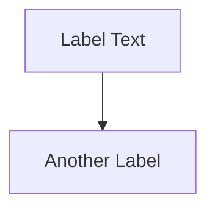

# Python Project Setup Guide

A comprehensive guide for setting up modern Python projects at MITRE with best practices, automation, and proper tooling (2025 standards).

## Quick Start Template

```bash
# 1. Create new project
mkdir my-project && cd my-project
git init -b main

# 2. Create pyproject.toml
cat > pyproject.toml << 'EOF'
[build-system]
requires = ["setuptools>=68.0.0", "python-semantic-release>=9.0.0"]
build-backend = "setuptools.build_meta"

[project]
name = "my-package"
version = "0.1.0"
description = "Brief description"
authors = [{name = "MITRE SAF Team", email = "saf@mitre.org"}]
readme = "README.md"
requires-python = ">=3.12"
license = {text = "Apache-2.0"}

dependencies = [
    # Add your dependencies
]

[project.optional-dependencies]
dev = [
    "pytest>=7.4.0",
    "pytest-cov>=4.1.0",
    "ruff>=0.14.0",
    "bandit[toml]>=1.7.0",
    "pre-commit>=4.0.0",
]

[project.scripts]
my-command = "my_package.cli:main"

[tool.ruff]
line-length = 100
target-version = "py312"

[tool.ruff.lint]
select = ["E", "W", "F", "I", "B", "C4", "UP", "S"]
ignore = ["E501", "S101"]

[tool.bandit]
exclude_dirs = ["/tests", "/.venv"]
EOF

# 3. Initialize uv
uv init
uv sync --all-extras

# 4. Setup pre-commit
uv run pre-commit install

# 5. Create basic structure
mkdir -p src/my_package tests docs
touch src/my_package/__init__.py
touch tests/__init__.py

# 6. Add GitHub workflows (see sections below)
mkdir -p .github/workflows

# 7. Add community files
# LICENSE.md, SECURITY.md, CODE_OF_CONDUCT.md, NOTICE.md
```

## Project Structure

### Standard Layout (src-layout recommended)

```
my-project/
├── .github/
│   └── workflows/
│       ├── ci.yml              # Test, lint, security
│       ├── release.yml         # Semantic release + PyPI
│       └── docs.yml            # MkDocs deployment
├── docs/                       # MkDocs documentation
│   ├── index.md
│   ├── getting-started.md
│   └── developer-guide/
│       ├── contributing.md
│       └── release-process.md
├── src/
│   └── my_package/
│       ├── __init__.py
│       ├── cli/                # CLI commands
│       ├── models/             # Data models
│       ├── utils/              # Utilities
│       └── data/               # Package data files
├── tests/
│   ├── __init__.py
│   ├── conftest.py
│   ├── unit/
│   ├── integration/
│   └── fixtures/               # Test data (committed!)
├── .gitignore
├── .pre-commit-config.yaml
├── CODE_OF_CONDUCT.md
├── LICENSE.md
├── NOTICE.md
├── README.md
├── SECURITY.md
├── mkdocs.yml
├── pyproject.toml
└── uv.lock                     # Commit this!
```

### Why src-layout?

- Prevents accidental imports from source during testing
- Clear separation between package code and project files
- Standard for modern Python projects
- Works with editable installs: `pip install -e .`

## Tooling Stack (2025 Standards)

### Package Manager: uv

**Why uv:**
- 10-100x faster than pip
- Better dependency resolution
- Replaces pip, pip-tools, virtualenv
- Industry standard (Astral, creators of ruff)

**Installation:**
```bash
curl -LsSf https://astral.sh/uv/install.sh | sh
```

**Key commands:**
```bash
uv sync                    # Install from uv.lock
uv sync --all-extras       # Include dev dependencies
uv add package             # Add dependency
uv add --dev pytest        # Add dev dependency
uv run pytest              # Run command in environment
uv run --frozen pytest     # Use lock file strictly
```

### Linting & Formatting: Ruff

**Why ruff only (no black):**
- Handles both linting AND formatting
- 10-100x faster than black
- Black-compatible formatting
- One tool instead of multiple

**Configuration in pyproject.toml:**
```toml
[tool.ruff]
line-length = 100
target-version = "py312"

[tool.ruff.lint]
select = [
    "E",   # pycodestyle errors
    "W",   # pycodestyle warnings
    "F",   # pyflakes
    "I",   # isort
    "B",   # flake8-bugbear
    "C4",  # flake8-comprehensions
    "UP",  # pyupgrade
    "S",   # flake8-bandit (security)
]
ignore = [
    "E501",  # line too long (formatter handles)
    "S101",  # assert in tests (allowed)
]

[tool.ruff.lint.per-file-ignores]
"tests/**/*.py" = ["S101", "S105", "S603", "S607"]
```

**Usage:**
```bash
ruff check .                 # Lint
ruff check --fix .          # Auto-fix
ruff format .               # Format
ruff format --check .       # Check formatting
```

### Security: Bandit

**Configuration:**
```toml
[tool.bandit]
exclude_dirs = ["/tests", "/.venv"]
skips = [
    "B101",  # assert in tests
    "B404",  # subprocess import
]
```

**Usage:**
```bash
uv run bandit -c pyproject.toml -r src/my_package/
```

### Testing: pytest

**Configuration:**
```toml
[tool.pytest.ini_options]
testpaths = ["tests"]
python_files = "test_*.py"
python_functions = "test_*"
addopts = ["--strict-markers", "--tb=short", "-v"]

[tool.coverage.run]
source = ["src"]
branch = true
omit = ["*/tests/*"]

[tool.coverage.report]
exclude_lines = [
    "pragma: no cover",
    "if __name__ == .__main__.:",
    "if TYPE_CHECKING:",
]
```

**Test structure:**
```
tests/
├── unit/           # Fast, isolated
├── integration/    # Component interaction
├── e2e/            # Full pipeline
└── fixtures/       # Test data (commit these!)
```

## CI/CD Setup

### 1. CI Workflow (.github/workflows/ci.yml)

```yaml
name: CI

on:
  push:
    branches: [main]
  pull_request:
    branches: [main]

jobs:
  ruff:
    name: Lint and Format
    runs-on: ubuntu-latest
    steps:
      - uses: actions/checkout@v4
      - uses: astral-sh/setup-uv@v7
        with:
          enable-cache: true
      - name: Lint
        run: uv run --frozen --all-extras ruff check .
      - name: Format check
        run: uv run --frozen --all-extras ruff format --check .

  security:
    name: Security Scan
    runs-on: ubuntu-latest
    steps:
      - uses: actions/checkout@v4
      - uses: astral-sh/setup-uv@v7
        with:
          enable-cache: true
      - name: Run Bandit
        run: uv run --frozen --all-extras --with bandit[toml] -- bandit -c pyproject.toml -r src/

  test:
    name: Test Python ${{ matrix.python-version }}
    runs-on: ubuntu-latest
    strategy:
      matrix:
        python-version: ["3.12", "3.13"]
    steps:
      - uses: actions/checkout@v4
      - uses: astral-sh/setup-uv@v7
        with:
          enable-cache: true
          python-version: ${{ matrix.python-version }}
      - name: Run tests
        run: uv run --frozen --all-extras pytest tests/ -v --cov=src --cov-report=xml
      - name: Upload coverage
        if: matrix.python-version == '3.12'
        uses: codecov/codecov-action@v4
        with:
          files: ./coverage.xml
```

**Key points:**
- Use `setup-uv@v7` with `enable-cache: true`
- Use `uv run --frozen --all-extras` for reproducible builds
- Test on Python 3.12 and 3.13 (modern versions)
- Upload coverage from one Python version only

### 2. Release Workflow (.github/workflows/release.yml)

```yaml
name: Release

on:
  workflow_run:
    workflows: ["CI"]
    types: [completed]
    branches: [main]

jobs:
  release:
    name: Semantic Release
    runs-on: ubuntu-latest
    if: ${{ github.event.workflow_run.conclusion == 'success' }}
    permissions:
      id-token: write    # PyPI trusted publishing
      contents: write    # Create releases/tags
    steps:
      - uses: actions/checkout@v4
        with:
          fetch-depth: 0
      - uses: astral-sh/setup-uv@v7
      - name: Install semantic-release
        run: uv pip install python-semantic-release
      - name: Semantic Release
        uses: python-semantic-release/python-semantic-release@v9.17.0
        with:
          github_token: ${{ secrets.GITHUB_TOKEN }}
      - name: Publish to PyPI
        if: steps.release.outputs.released == 'true'
        uses: pypa/gh-action-pypi-publish@release/v1
```

**Key points:**
- Runs AFTER CI passes (workflow_run trigger)
- Uses python-semantic-release for automation
- PyPI trusted publisher (no tokens needed)
- Creates tags, releases, CHANGELOG.md automatically

### 3. Docs Workflow (.github/workflows/docs.yml)

```yaml
name: Deploy Documentation

on:
  workflow_run:
    workflows: ["Release"]
    types: [completed]
    branches: [main]

permissions:
  contents: read
  pages: write
  id-token: write

jobs:
  build:
    runs-on: ubuntu-latest
    if: ${{ github.event.workflow_run.conclusion == 'success' }}
    steps:
      - uses: actions/checkout@v4
      - uses: actions/setup-python@v5
        with:
          python-version: "3.x"
      - name: Install MkDocs
        run: pip install mkdocs-material mkdocs-autorefs
      - name: Build
        run: mkdocs build
      - uses: actions/upload-pages-artifact@v3
        with:
          path: site

  deploy:
    needs: build
    runs-on: ubuntu-latest
    environment:
      name: github-pages
      url: ${{ steps.deployment.outputs.page_url }}
    steps:
      - uses: actions/deploy-pages@v4
        id: deployment
```

**Key points:**
- Runs AFTER Release succeeds
- Ensures docs match published version
- Uses GitHub Actions deployment (not gh-deploy)

## Versioning & Releases

### Semantic Release Configuration

**pyproject.toml:**
```toml
[tool.semantic_release]
version_toml = ["pyproject.toml:project.version"]
branch = "main"
upload_to_vcs_release = true
upload_to_pypi = false  # Workflow handles this
build_command = "pip install build && python -m build"

[tool.semantic_release.commit_parser_options]
allowed_tags = ["feat", "fix", "docs", "chore", "refactor", "test"]
minor_tags = ["feat"]
patch_tags = ["fix"]
```

### Conventional Commits

**Version bumping:**
```bash
feat: add feature      # 0.1.0 → 0.2.0 (minor)
fix: resolve bug       # 0.2.0 → 0.2.1 (patch)
BREAKING CHANGE:       # 0.2.0 → 1.0.0 (major)
```

**No version bump:**
```bash
docs: update README
chore: update dependencies
test: add tests
refactor: restructure code
```

### Workflow

1. Create feature branch: `git checkout -b feat/new-thing`
2. Make changes, commit: `git commit -m "feat: add thing"`
3. Push branch: `git push origin feat/new-thing`
4. Create PR: `gh pr create`
5. Merge PR → semantic-release runs automatically
6. Version bumped, tag created, published to PyPI

## PyPI Publishing

### Trusted Publisher Setup

1. Go to https://pypi.org/manage/account/publishing/
2. Add pending publisher:
   - **PyPI Project:** package-name
   - **Owner:** mitre
   - **Repository:** repo-name
   - **Workflow:** release.yml
   - **Environment:** (leave blank)

### Organization Membership

To publish under MITRE organization:
1. Transfer package to org after first publish
2. Or create as org member from the start

### First Release

```bash
# Trigger first release
git commit -m "feat: initial release" --allow-empty
git push origin main
# CI runs → Release creates v0.1.0 → Publishes to PyPI
```

## Pre-commit Hooks

### Configuration (.pre-commit-config.yaml)

```yaml
repos:
  - repo: https://github.com/pre-commit/pre-commit-hooks
    rev: v6.0.0
    hooks:
      - id: trailing-whitespace
      - id: end-of-file-fixer
      - id: check-yaml
      - id: check-toml
      - id: check-json
      - id: check-added-large-files
      - id: check-merge-conflict
      - id: mixed-line-ending
        args: [--fix=lf]

  - repo: https://github.com/astral-sh/ruff-pre-commit
    rev: v0.14.9
    hooks:
      - id: ruff
        args: [--fix, --exit-non-zero-on-fix]
      - id: ruff-format

  - repo: https://github.com/PyCQA/bandit
    rev: 1.9.2
    hooks:
      - id: bandit
        args: ["-c", "pyproject.toml"]
        additional_dependencies: ["bandit[toml]"]

default_language_version:
  python: python3.12
```

### Installation

```bash
# Install hooks (one-time)
uv run pre-commit install

# Hooks run automatically on git commit
# To run manually:
pre-commit run --all-files
```

## Documentation (MkDocs)

### Setup

**Install:**
```bash
uv add --dev mkdocs-material mkdocs-autorefs
```

**mkdocs.yml template:**
```yaml
site_name: Project Name
site_description: Brief description
site_author: MITRE SAF Team
site_url: https://mitre.github.io/project-name

repo_name: mitre/project-name
repo_url: https://github.com/mitre/project-name

theme:
  name: material
  palette:
    - scheme: default
      primary: indigo
      toggle:
        icon: material/brightness-7
        name: Dark mode
    - scheme: slate
      primary: indigo
      toggle:
        icon: material/brightness-4
        name: Light mode

plugins:
  - search
  - autorefs

markdown_extensions:
  - admonition
  - pymdownx.details
  - pymdownx.superfences:
      custom_fences:
        - name: mermaid
          class: mermaid
  - pymdownx.highlight
  - pymdownx.tabbed
  - toc:
      permalink: true

nav:
  - Home: index.md
  - Getting Started: getting-started.md
  - Developer Guide:
      - Contributing: developer-guide/contributing.md
      - Release Process: developer-guide/release-process.md

extra:
  social:
    - icon: fontawesome/brands/github
      link: https://github.com/mitre/project-name
```

### Mermaid Diagrams (IMPORTANT)

**Correct syntax:**
```markdown

```

**Rules:**
- Use `flowchart TD` or `flowchart LR` (NOT `graph`)
- ALL labels in quotes: `NODE["Label"]`
- ALL subgraph labels in quotes
- No special characters (→) in labels

## Community Health Files

### SECURITY.md

```markdown
# Security Policy

## Reporting Security Issues

Contact: [saf-security@mitre.org](mailto:saf-security@mitre.org)

Include:
1. Description of vulnerability
2. Steps to reproduce
3. Potential impact
4. Suggested fix
5. Version affected

Response: 48 hours acknowledgment, 7 days assessment
```

### CODE_OF_CONDUCT.md

```markdown
# Code of Conduct

Adopts [Contributor Covenant](https://www.contributor-covenant.org/version/2/1/code_of_conduct/)

Contact: [saf@mitre.org](mailto:saf@mitre.org)
```

### NOTICE.md

```markdown
# Notice

Copyright © 2025 The MITRE Corporation

Approved for Public Release; Distribution Unlimited. Case Number 18-3678.

Licensed under the Apache License, Version 2.0.
See LICENSE.md for full text.
```

### LICENSE.md (Apache 2.0)

```
Copyright © 2025 The MITRE Corporation.

Approved for Public Release; Distribution Unlimited. Case Number 18-3678.

Licensed under the Apache License, Version 2.0...
[Full Apache 2.0 text]
```

## Git Workflow (CRITICAL)

### Branch-Based Development

**NEVER commit directly to main when using semantic-release.**

```bash
# Create feature branch
git checkout -b feat/add-capability

# Make changes
git commit -m "feat: add new capability"

# Push branch
git push origin feat/add-capability

# Create PR
gh pr create --title "Add capability"

# After merge, semantic-release runs on main
```

**Why:** Semantic-release creates version commits on main. Working directly on main causes constant rebase conflicts.

### Conventional Commit Format

```
<type>: <description>

[optional body]

[optional footer]
```

**Types:**
- `feat:` - New feature
- `fix:` - Bug fix
- `docs:` - Documentation
- `chore:` - Maintenance
- `refactor:` - Code restructure
- `test:` - Tests
- `ci:` - CI/CD changes

## README Template

```markdown
# Project Name

> Brief description

[](https://pypi.org/project/package-name/)
[](https://python.org)
[](https://github.com/mitre/repo/actions)
[](LICENSE.md)

## Quick Start

```bash
# Install
uv tool install package-name

# Use
command --help
```

## Features

- Feature 1
- Feature 2
- Feature 3

## Documentation

Full documentation: https://mitre.github.io/project-name

## Contributing

See [CONTRIBUTING.md](docs/developer-guide/contributing.md)

## License

Apache 2.0 - See [LICENSE.md](LICENSE.md)

## Security

See [SECURITY.md](SECURITY.md) for vulnerability disclosure.

Copyright © 2025 The MITRE Corporation
```

## Python Version Requirements

### Modern Standard (2025)

**Require Python 3.12+:**
- 3.13 released Oct 2024 (latest)
- 3.12 widely adopted, stable
- 3.11 still popular
- 3.10 EOL Oct 2026
- 3.9 EOL Oct 2025
- 3.8 already EOL

**pyproject.toml:**
```toml
requires-python = ">=3.12"

classifiers = [
    "Programming Language :: Python :: 3",
    "Programming Language :: Python :: 3.12",
    "Programming Language :: Python :: 3.13",
]
```

**CI matrix:**
```yaml
strategy:
  matrix:
    python-version: ["3.12", "3.13"]
```

## Dependencies Best Practices

### pyproject.toml Organization

```toml
dependencies = [
    # Core functionality
    "requests>=2.31.0",
    "click>=8.1.0",

    # Data handling
    "pydantic>=2.0.0",
    "pyyaml>=6.0.0",
]

[project.optional-dependencies]
dev = [
    # Testing
    "pytest>=7.4.0",
    "pytest-cov>=4.1.0",
    "pytest-mock>=3.12.0",

    # Code quality
    "ruff>=0.14.0",
    "bandit[toml]>=1.7.0",
    "pre-commit>=4.0.0",

    # Documentation
    "mkdocs-material>=9.5.0",
]
```

### Version Pinning

- **Minimum versions** with `>=` for flexibility
- **Lock file (uv.lock)** for reproducibility
- **CI uses --frozen** to match lock file
- Update dependencies regularly

## .gitignore Template

```gitignore
# Python
__pycache__/
*.py[cod]
*.so
.Python
*.egg-info/
dist/
build/
.venv/
venv/

# Testing
.pytest_cache/
.coverage
htmlcov/
*.cover

# IDEs
.vscode/
.idea/
*.swp

# Project-specific outputs (root-level only!)
/output/
/downloads/
/*.tmp

# Keep test fixtures!
# Don't exclude tests/fixtures/

# Internal docs (not for repo)
CLAUDE.md
SESSION*.md
research/
*-backup/
```

**Critical:** Use `/` prefix for root-level exclusions only. Don't exclude test fixtures!

## Package Data Inclusion

### setup.py (if needed)

```python
package_data={
    "my_package": [
        "data/*.json",
        "data/*.yaml",
        "configs/*.yaml",
    ],
}
include_package_data=True
```

### Manifest (if using)

**MANIFEST.in:**
```
include LICENSE.md
include README.md
recursive-include src/my_package/data *.json
recursive-include src/my_package/configs *.yaml
```

## Common Pitfalls & Solutions

### 1. Formatter Conflicts

**Problem:** Black and ruff-format fight over code style.
**Solution:** Use ONLY ruff (handles both linting and formatting).

### 2. Missing Dependencies in CI

**Problem:** `pytest: command not found` in CI.
**Solution:** Use `uv run --frozen --all-extras` to install dev dependencies.

### 3. Git Rebase Loops

**Problem:** Constant rebasing when working on main.
**Solution:** Work on feature branches, create PRs. Semantic-release commits to main.

### 4. Gitignored Test Fixtures

**Problem:** Tests pass locally, fail in CI (missing fixtures).
**Solution:** Use `/benchmarks/` not `benchmarks/` in .gitignore.

### 5. Security False Positives

**Problem:** Bandit/ruff flag XML parsing, subprocess calls.
**Solution:** Add to per-file-ignores with clear justification comment.

### 6. Pre-commit Hooks Not Running

**Problem:** Hooks don't run on commit.
**Solution:** Run `pre-commit install` after cloning.

## Development Checklist

### Before First Commit

- [ ] Create pyproject.toml with all metadata
- [ ] Initialize uv: `uv init && uv sync --all-extras`
- [ ] Set up pre-commit: `pre-commit install`
- [ ] Create GitHub workflows (ci.yml, release.yml, docs.yml)
- [ ] Add community files (SECURITY, CODE_OF_CONDUCT, LICENSE, NOTICE)
- [ ] Write README with badges
- [ ] Create mkdocs.yml and initial docs
- [ ] Add .gitignore (use template above)
- [ ] Verify tests pass: `uv run pytest`
- [ ] Verify linting: `ruff check .`
- [ ] Verify formatting: `ruff format --check .`

### Before Every Commit

- [ ] Tests pass: `uv run pytest tests/`
- [ ] Linting clean: `ruff check .`
- [ ] Formatting clean: `ruff format --check .` (or just run `ruff format .`)
- [ ] Security clean: `uv run bandit -c pyproject.toml -r src/`
- [ ] Pre-commit hooks pass (they run automatically)

### Before Creating PR

- [ ] All commits use conventional format
- [ ] Tests pass in CI
- [ ] Branch is up to date with main
- [ ] PR description explains changes
- [ ] Breaking changes documented

## Testing Best Practices

### Test Organization

```python
tests/
├── unit/              # Fast, isolated, mocked
│   ├── test_models.py
│   └── test_utils.py
├── integration/       # Component interaction
│   ├── test_api.py
│   └── test_database.py
├── e2e/              # Full pipeline
│   └── test_workflows.py
└── fixtures/         # Committed test data
    ├── valid_input.json
    └── expected_output.xml
```

### Test Fixtures

**ALWAYS commit test fixtures:**
```python
# conftest.py
import pytest
from pathlib import Path

@pytest.fixture
def fixture_path():
    return Path(__file__).parent / "fixtures"

@pytest.fixture
def sample_data(fixture_path):
    with open(fixture_path / "sample.json") as f:
        return json.load(f)
```

**Don't gitignore fixtures:**
```gitignore
# ❌ WRONG:
benchmarks/
*.json

# ✅ CORRECT:
/output/benchmarks/     # Root-level user outputs only
/debug_*.json           # Root-level debug files only
```

### Coverage Configuration

```toml
[tool.coverage.run]
source = ["src"]
branch = true

[tool.coverage.report]
fail_under = 80  # Adjust as needed
exclude_lines = [
    "pragma: no cover",
    "if __name__ == .__main__.:",
    "if TYPE_CHECKING:",
]
```

## Security Best Practices

### 1. Input Validation

```python
from urllib.parse import urlparse

def validate_url(url: str, allowed_host: str):
    parsed = urlparse(url)
    if parsed.netloc != allowed_host or parsed.scheme != "https":
        raise ValueError(f"Invalid URL - must be https://{allowed_host}")
    return url
```

### 2. Subprocess Security

```python
import shutil
import subprocess

# ✅ CORRECT: Full paths, no shell=True
cmd = shutil.which("command")
if not cmd:
    raise FileNotFoundError("command not found")
subprocess.run([cmd, validated_arg], check=True, capture_output=True)

# ❌ WRONG: Partial path, shell=True
subprocess.run(["command", arg], shell=True)
```

### 3. Credential Handling

```python
# ✅ CORRECT: Environment variables
import os
api_key = os.getenv("API_KEY")

# ❌ WRONG: Hardcoded
api_key = "sk-1234567890"
```

### 4. XML Processing

```python
# Document why it's safe
from lxml import etree

# Safe: parsing XML we generated ourselves
tree = etree.parse(our_generated_file)  # Ignore S320 warning
```

## Type Annotations

### Modern Python 3.12+ Syntax

```python
from __future__ import annotations  # Add this for lxml compatibility

def process(data: dict[str, Any] | None) -> list[str]:
    """Process data and return results."""
    if data is None:
        return []
    return [str(v) for v in data.values()]
```

**Why `from __future__ import annotations`:**
- Required for compatibility with Cython extensions (lxml)
- Makes type hints strings evaluated lazily
- Avoids runtime type errors

## README Badges

### Standard Badges

```markdown
[](https://pypi.org/project/package-name/)
[](https://python.org)
[](https://github.com/mitre/repo/actions)
[](https://codecov.io/gh/mitre/repo)
[](LICENSE.md)
```

### Recommended Order

1. PyPI version (most important for users)
2. Python version requirement
3. CI status
4. Code coverage
5. License

## Troubleshooting

### CI Failures

**Ruff formatting failed:**
```bash
# Locally format
ruff format .

# Commit fix
git add .
git commit -m "chore: auto-format with ruff"
```

**Tests failing:**
```bash
# Run locally with verbose output
uv run pytest tests/ -vv --tb=short

# Check specific test
uv run pytest tests/unit/test_models.py::test_specific -vv
```

**Bandit security issues:**
```bash
# Check locally
uv run bandit -c pyproject.toml -r src/

# If false positive, add to per-file-ignores with justification
```

### Lock File Issues

**uv.lock out of sync:**
```bash
# Regenerate lock file
uv lock

# Commit updated lock
git add uv.lock
git commit -m "chore: update dependency lock file"
```

### Release Not Triggered

**Check commit message:**
```bash
# View recent commits
git log --oneline -5

# Commits must start with feat:, fix:, etc.
# docs:, chore: won't trigger releases
```

## Migration Checklist

### From Existing Project

- [ ] Update pyproject.toml to modern format
- [ ] Initialize uv: `uv init && uv sync --all-extras`
- [ ] Remove black, keep only ruff
- [ ] Update Python requirement to 3.12+
- [ ] Set up semantic-release
- [ ] Create GitHub workflows
- [ ] Add pre-commit hooks
- [ ] Add community health files
- [ ] Set up PyPI trusted publisher
- [ ] Document gitflow workflow
- [ ] Test everything locally
- [ ] Create initial release

## Quick Reference Commands

### Local Development

```bash
# Setup
uv sync --all-extras              # Install dependencies
uv run pre-commit install         # Setup hooks

# Testing
uv run pytest tests/              # Run tests
uv run pytest --cov=src           # With coverage
uv run pytest -k test_name        # Specific test

# Code Quality
ruff check .                      # Lint
ruff format .                     # Format
uv run bandit -c pyproject.toml -r src/  # Security

# Run pre-commit manually
pre-commit run --all-files

# Update dependencies
uv lock                           # Regenerate lock
uv add package                    # Add dependency
uv add --dev pytest               # Add dev dependency
```

### GitHub Operations

```bash
# Create feature branch
git checkout -b feat/feature-name

# Push and create PR
git push origin feat/feature-name
gh pr create --title "Title" --body "Description"

# Check CI status
gh run list --limit 5
gh run watch

# Check releases
gh release list --limit 5
```

### PyPI Operations

```bash
# Check current version
python -c "import importlib.metadata; print(importlib.metadata.version('package-name'))"

# Install from PyPI
pip install package-name
uv tool install package-name

# Check on PyPI
open https://pypi.org/project/package-name/
```

## Resources

- **uv docs:** https://docs.astral.sh/uv/
- **Ruff docs:** https://docs.astral.sh/ruff/
- **Semantic Release:** https://python-semantic-release.readthedocs.io/
- **Conventional Commits:** https://www.conventionalcommits.org/
- **MkDocs Material:** https://squidfunk.github.io/mkdocs-material/
- **PyPI Trusted Publishers:** https://docs.pypi.org/trusted-publishers/

## Template Repository

This guide is based on:
- mitre/cis-bench (this project)
- mitre/repo-minder

For questions: saf@mitre.org
